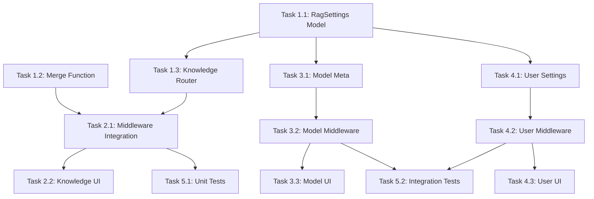

# PRP: Per-Level RAG Settings Enhancement

## Executive Summary

This PRP implements granular RAG settings at multiple levels (Knowledge Collection, Model, User, Chat) instead of relying solely on global admin settings. Users and content managers will be able to customize retrieval behavior for specific knowledge bases, models, or contexts. The implementation uses existing JSON fields (`meta`, `settings`) requiring no database migrations.

**Settings Schema:**
```typescript
interface RagSettings {
  top_k?: number;                    // Number of chunks to retrieve (1-20)
  top_k_reranker?: number;           // Results after reranking (1-20)
  relevance_threshold?: number;      // Minimum score filter (0.0-1.0)
  enable_hybrid_search?: boolean;    // Enable BM25+Vector hybrid
  hybrid_bm25_weight?: number;       // BM25 weight in hybrid (0.0-1.0)
  full_context?: boolean;            // Bypass retrieval, use full documents
}
```

**Priority Cascade:** Knowledge > Chat > Model > User > Global

---

## Implementation Tasks

### Phase 1: Foundation - Settings Merge Logic & Backend Types

#### Task 1.1: Create RagSettings Pydantic Model
**Files to modify:**
- `backend/open_webui/models/knowledge.py` - Add RagSettings model and update KnowledgeForm

**Implementation steps:**
1. Add `RagSettings` Pydantic model with optional fields for all RAG settings
2. Add `meta` field to `KnowledgeForm` to allow API updates
3. Add type hints for the settings

**Code to add after line 91 in knowledge.py:**
```python
class RagSettings(BaseModel):
    top_k: Optional[int] = None
    top_k_reranker: Optional[int] = None
    relevance_threshold: Optional[float] = None
    enable_hybrid_search: Optional[bool] = None
    hybrid_bm25_weight: Optional[float] = None
    full_context: Optional[bool] = None

    model_config = ConfigDict(extra="ignore")


class KnowledgeMeta(BaseModel):
    rag_settings: Optional[RagSettings] = None

    model_config = ConfigDict(extra="allow")
```

**Modify KnowledgeForm (line 95-99):**
```python
class KnowledgeForm(BaseModel):
    name: str
    description: str
    data: Optional[dict] = None
    meta: Optional[KnowledgeMeta] = None  # ADD THIS
    access_control: Optional[dict] = None
```

**Acceptance criteria:**
- [ ] RagSettings model validates all field types and ranges
- [ ] KnowledgeMeta wraps RagSettings with extra="allow" for extensibility
- [ ] KnowledgeForm includes optional meta field

---

#### Task 1.2: Create Settings Merge Function
**Files to modify:**
- `backend/open_webui/retrieval/utils.py` - Add merge_rag_settings function

**Implementation steps:**
1. Create `merge_rag_settings()` function that takes multiple RagSettings dicts
2. Implement priority-based merging (later args override earlier)
3. Return merged settings dict with all fields populated from cascade

**Code to add near top of retrieval/utils.py (after imports):**
```python
from typing import Optional, Dict, Any

def merge_rag_settings(*settings_dicts: Optional[Dict[str, Any]]) -> Dict[str, Any]:
    """
    Merge RAG settings from multiple sources with priority cascade.
    Later arguments override earlier ones. None values are skipped.

    Priority order (pass in this order): global, user, model, chat, knowledge
    """
    merged = {}
    rag_keys = [
        'top_k', 'top_k_reranker', 'relevance_threshold',
        'enable_hybrid_search', 'hybrid_bm25_weight', 'full_context'
    ]

    for settings in settings_dicts:
        if settings is None:
            continue
        for key in rag_keys:
            if key in settings and settings[key] is not None:
                merged[key] = settings[key]

    return merged
```

**Acceptance criteria:**
- [ ] Function correctly merges settings from multiple sources
- [ ] None values do not override existing values
- [ ] Later arguments take priority over earlier ones
- [ ] Only recognized RAG keys are included in output

---

#### Task 1.3: Update Knowledge Router to Accept Meta
**Files to modify:**
- `backend/open_webui/routers/knowledge.py` - Update update_knowledge_by_id endpoint

**Implementation steps:**
1. Modify the update endpoint to read `form_data.meta`
2. Pass meta to the `Knowledges.update_knowledge_by_id()` call
3. Ensure meta is properly serialized to JSON

**Locate update_knowledge_by_id() around line 297-346 and modify:**

Find where `Knowledges.update_knowledge_by_id()` is called and ensure it passes meta:
```python
knowledge = Knowledges.update_knowledge_by_id(
    id=knowledge_id,
    form_data=form_data,  # form_data now includes meta
)
```

**Also verify Knowledges.update_knowledge_by_id in models/knowledge.py handles meta:**
Look for the update method and ensure it includes:
```python
if form_data.meta is not None:
    knowledge.meta = form_data.meta.model_dump() if hasattr(form_data.meta, 'model_dump') else form_data.meta
```

**Acceptance criteria:**
- [ ] PUT /api/v1/knowledge/{id} accepts meta in request body
- [ ] Meta is persisted to database
- [ ] GET /api/v1/knowledge/{id} returns meta field

---

### Phase 2: Knowledge Collection Level Integration

#### Task 2.1: Read Knowledge RAG Settings in Middleware
**Files to modify:**
- `backend/open_webui/utils/middleware.py` - Modify chat_completion_files_handler

**Implementation steps:**
1. Import merge_rag_settings from retrieval.utils
2. After identifying knowledge IDs from files, fetch their meta.rag_settings
3. Merge knowledge settings with global settings
4. Pass merged settings to get_sources_from_items()

**Locate chat_completion_files_handler() around line 941:**

Add import at top:
```python
from open_webui.retrieval.utils import merge_rag_settings
```

Before calling get_sources_from_items (around line 1004), add logic to fetch and merge knowledge settings:
```python
# Collect RAG settings from knowledge bases
knowledge_rag_settings = None
knowledge_ids = [f.get("knowledge_id") for f in files if f.get("type") == "knowledge" and f.get("knowledge_id")]
if knowledge_ids:
    # For now, use first knowledge base's settings (can be enhanced to merge multiple)
    from open_webui.models.knowledge import Knowledges
    for kid in knowledge_ids:
        kb = Knowledges.get_knowledge_by_id(kid)
        if kb and kb.meta and isinstance(kb.meta, dict):
            kb_rag = kb.meta.get("rag_settings")
            if kb_rag:
                knowledge_rag_settings = kb_rag
                break  # Use first KB with settings

# Build global settings dict
global_settings = {
    "top_k": request.app.state.config.TOP_K,
    "top_k_reranker": request.app.state.config.TOP_K_RERANKER,
    "relevance_threshold": request.app.state.config.RELEVANCE_THRESHOLD,
    "enable_hybrid_search": request.app.state.config.ENABLE_RAG_HYBRID_SEARCH,
    "hybrid_bm25_weight": request.app.state.config.HYBRID_BM25_WEIGHT,
    "full_context": request.app.state.config.RAG_FULL_CONTEXT,
}

# Merge with cascade priority: global < knowledge
effective_settings = merge_rag_settings(global_settings, knowledge_rag_settings)
```

Then modify get_sources_from_items call to use effective_settings:
```python
sources = await get_sources_from_items(
    request=request,
    items=files,
    queries=queries,
    k=effective_settings.get("top_k", request.app.state.config.TOP_K),
    k_reranker=effective_settings.get("top_k_reranker", request.app.state.config.TOP_K_RERANKER),
    r=effective_settings.get("relevance_threshold", request.app.state.config.RELEVANCE_THRESHOLD),
    hybrid_bm25_weight=effective_settings.get("hybrid_bm25_weight", request.app.state.config.HYBRID_BM25_WEIGHT),
    hybrid_search=effective_settings.get("enable_hybrid_search", request.app.state.config.ENABLE_RAG_HYBRID_SEARCH),
    full_context=all_full_context or effective_settings.get("full_context", request.app.state.config.RAG_FULL_CONTEXT),
    embedding_function=request.app.state.EMBEDDING_FUNCTION,
    reranking_function=request.app.state.rf,
    RAG_EMBEDDING_OPENAI_BATCH_SIZE=request.app.state.config.RAG_EMBEDDING_OPENAI_BATCH_SIZE,
)
```

**Acceptance criteria:**
- [ ] Knowledge base RAG settings are fetched when knowledge files are present
- [ ] Settings merge correctly with global defaults
- [ ] Per-KB settings override global when specified
- [ ] Missing per-KB settings fall back to global

---

#### Task 2.2: Create Knowledge RAG Settings UI Component
**Files to modify:**
- `src/lib/components/workspace/Knowledge/KnowledgeEditor.svelte` (or equivalent edit modal)

**Implementation steps:**
1. Find the Knowledge edit component/modal
2. Add a collapsible "RAG Settings" section
3. Add form fields for each RAG setting with proper defaults and validation
4. Bind to knowledge.meta.rag_settings object
5. Ensure save action includes meta in API call

**UI fields to add:**
```svelte
<Collapsible title="RAG Settings (Override Global)" open={false}>
  <div class="space-y-4">
    <div>
      <label>Top K Results</label>
      <input type="number" min="1" max="20" bind:value={meta.rag_settings.top_k} placeholder="Use global default" />
    </div>
    <div>
      <label>Relevance Threshold</label>
      <input type="number" min="0" max="1" step="0.05" bind:value={meta.rag_settings.relevance_threshold} placeholder="Use global default" />
    </div>
    <div>
      <label>Enable Hybrid Search</label>
      <select bind:value={meta.rag_settings.enable_hybrid_search}>
        <option value={null}>Use global default</option>
        <option value={true}>Enabled</option>
        <option value={false}>Disabled</option>
      </select>
    </div>
    <div>
      <label>Hybrid BM25 Weight</label>
      <input type="number" min="0" max="1" step="0.1" bind:value={meta.rag_settings.hybrid_bm25_weight} placeholder="Use global default" />
    </div>
    <div>
      <label>Full Context Mode</label>
      <select bind:value={meta.rag_settings.full_context}>
        <option value={null}>Use global default</option>
        <option value={true}>Enabled</option>
        <option value={false}>Disabled</option>
      </select>
    </div>
  </div>
</Collapsible>
```

**Acceptance criteria:**
- [ ] RAG settings section appears in Knowledge edit UI
- [ ] All 6 settings have appropriate input controls
- [ ] Null/undefined values shown as "Use global default"
- [ ] Changes persist when saving knowledge base
- [ ] UI validation prevents invalid values

---

### Phase 3: Model Level Settings

#### Task 3.1: Add RAG Settings to Model Meta
**Files to modify:**
- `backend/open_webui/models/models.py` - Verify ModelMeta supports rag_settings

**Implementation steps:**
1. Verify ModelMeta has `extra="allow"` (it does per research)
2. Document that `meta.rag_settings` can be added
3. Optionally add explicit type hint

**Verify ModelMeta around line 37-49:**
```python
class ModelMeta(BaseModel):
    profile_image_url: Optional[str] = "/static/favicon.png"
    description: Optional[str] = None
    capabilities: Optional[dict] = None
    # rag_settings: Optional[RagSettings] = None  # Can add explicit field
    model_config = ConfigDict(extra="allow")  # Already allows rag_settings
```

**Acceptance criteria:**
- [ ] ModelMeta accepts rag_settings in its dict
- [ ] Model API endpoints accept/return rag_settings in meta

---

#### Task 3.2: Read Model RAG Settings in Middleware
**Files to modify:**
- `backend/open_webui/utils/middleware.py` - Extend settings merge to include model

**Implementation steps:**
1. In chat_completion_files_handler, get model info (already available in context)
2. Extract model.meta.rag_settings if present
3. Add to merge cascade: global < model < knowledge

**Add after knowledge settings fetch:**
```python
# Get model RAG settings
model_rag_settings = None
if model and hasattr(model, 'meta') and model.meta:
    model_meta = model.meta if isinstance(model.meta, dict) else model.meta.model_dump()
    model_rag_settings = model_meta.get("rag_settings")

# Merge with cascade: global < model < knowledge
effective_settings = merge_rag_settings(global_settings, model_rag_settings, knowledge_rag_settings)
```

**Acceptance criteria:**
- [ ] Model RAG settings are read when model has them
- [ ] Model settings override global but are overridden by knowledge
- [ ] Works with existing model selection flow

---

#### Task 3.3: Create Model RAG Settings UI
**Files to modify:**
- `src/lib/components/workspace/Models/ModelEditor.svelte` (or equivalent)

**Implementation steps:**
1. Find Model edit component
2. Add collapsible RAG Settings section (similar to Knowledge)
3. Bind to model.meta.rag_settings

**Acceptance criteria:**
- [ ] RAG settings section in Model edit UI
- [ ] Settings persist when saving model
- [ ] Clear indication these are model-level overrides

---

### Phase 4: User Level Settings

#### Task 4.1: Add RAG Settings to User Settings
**Files to modify:**
- `backend/open_webui/models/users.py` - Verify UserSettings supports rag_settings

**Implementation steps:**
1. Verify UserSettings has `extra="allow"` (it does per research)
2. User settings are stored in User.settings JSON field
3. Document that `settings.rag_settings` can be added

**Verify UserSettings around line 51-54:**
```python
class UserSettings(BaseModel):
    ui: Optional[dict] = {}
    # rag_settings: Optional[RagSettings] = None  # Can add explicit
    model_config = ConfigDict(extra="allow")  # Already supports extension
```

**Acceptance criteria:**
- [ ] UserSettings accepts rag_settings dict
- [ ] User settings API accepts/returns rag_settings

---

#### Task 4.2: Read User RAG Settings in Middleware
**Files to modify:**
- `backend/open_webui/utils/middleware.py` - Extend merge to include user

**Implementation steps:**
1. Get user from request context (already available)
2. Extract user.settings.rag_settings if present
3. Update cascade: global < user < model < knowledge

**Add to middleware:**
```python
# Get user RAG settings
user_rag_settings = None
if user and hasattr(user, 'settings') and user.settings:
    user_settings = user.settings if isinstance(user.settings, dict) else user.settings.model_dump()
    user_rag_settings = user_settings.get("rag_settings")

# Merge with full cascade: global < user < model < knowledge
effective_settings = merge_rag_settings(
    global_settings,
    user_rag_settings,
    model_rag_settings,
    knowledge_rag_settings
)
```

**Acceptance criteria:**
- [ ] User RAG settings are read from user.settings
- [ ] User settings override global, overridden by model and knowledge
- [ ] Works with authentication flow

---

#### Task 4.3: Create User RAG Settings UI
**Files to modify:**
- `src/lib/components/chat/Settings/Interface.svelte` (or user settings page)

**Implementation steps:**
1. Find user settings component
2. Add RAG Settings section
3. Bind to user settings.rag_settings
4. Call user settings update API on save

**Acceptance criteria:**
- [ ] RAG settings section in User Settings
- [ ] Settings persist via user settings API
- [ ] Clear indication these are personal defaults

---

### Phase 5: Testing & Documentation

#### Task 5.1: Unit Tests for Merge Function
**Files to create:**
- `backend/tests/unit/test_rag_settings_merge.py`

**Implementation steps:**
1. Test merge_rag_settings with various input combinations
2. Test priority cascade order
3. Test handling of None/missing values
4. Test edge cases (empty dicts, all None, etc.)

**Test cases:**
```python
def test_merge_single_source():
    result = merge_rag_settings({"top_k": 5})
    assert result["top_k"] == 5

def test_merge_cascade_priority():
    global_s = {"top_k": 4, "relevance_threshold": 0.5}
    user_s = {"top_k": 6}
    knowledge_s = {"relevance_threshold": 0.8}
    result = merge_rag_settings(global_s, user_s, knowledge_s)
    assert result["top_k"] == 6  # user overrides global
    assert result["relevance_threshold"] == 0.8  # knowledge overrides all

def test_merge_none_values_ignored():
    global_s = {"top_k": 4}
    user_s = {"top_k": None}
    result = merge_rag_settings(global_s, user_s)
    assert result["top_k"] == 4  # None doesn't override
```

**Acceptance criteria:**
- [ ] All merge scenarios tested
- [ ] Edge cases covered
- [ ] Tests pass in CI

---

#### Task 5.2: Integration Testing
**Files to create:**
- `backend/tests/integration/test_per_level_rag.py`

**Test scenarios:**
1. Create knowledge base with rag_settings, verify retrieval uses them
2. Create model with rag_settings, verify cascade
3. Set user rag_settings, verify they apply
4. Test full cascade with all levels set

**Acceptance criteria:**
- [ ] End-to-end test for knowledge level settings
- [ ] End-to-end test for model level settings
- [ ] End-to-end test for user level settings
- [ ] Cascade priority verified

---

## File Change Summary

| File | Action | Description |
|------|--------|-------------|
| `backend/open_webui/models/knowledge.py` | MODIFY | Add RagSettings, KnowledgeMeta models; update KnowledgeForm |
| `backend/open_webui/retrieval/utils.py` | MODIFY | Add merge_rag_settings() function |
| `backend/open_webui/routers/knowledge.py` | MODIFY | Update endpoint to handle meta field |
| `backend/open_webui/utils/middleware.py` | MODIFY | Read and merge settings from all levels |
| `backend/open_webui/models/models.py` | VERIFY | Confirm ModelMeta supports rag_settings |
| `backend/open_webui/models/users.py` | VERIFY | Confirm UserSettings supports rag_settings |
| `src/lib/components/workspace/Knowledge/*.svelte` | MODIFY | Add RAG settings UI to knowledge editor |
| `src/lib/components/workspace/Models/*.svelte` | MODIFY | Add RAG settings UI to model editor |
| `src/lib/components/chat/Settings/*.svelte` | MODIFY | Add RAG settings UI to user settings |
| `backend/tests/unit/test_rag_settings_merge.py` | CREATE | Unit tests for merge function |
| `backend/tests/integration/test_per_level_rag.py` | CREATE | Integration tests |

---

## Dependencies



---

## Testing Plan

### Unit Tests
- `merge_rag_settings()` with single source
- `merge_rag_settings()` with multiple sources, priority order
- `merge_rag_settings()` with None values (should not override)
- `merge_rag_settings()` with partial settings at each level
- `RagSettings` model validation (ranges, types)

### Integration Tests
- Create KB with rag_settings, verify GET returns them
- Create KB with rag_settings, send chat, verify retrieval uses settings
- Set model rag_settings, verify cascade order
- Set user rag_settings, verify cascade order
- Full cascade test: all 4 levels with different values

### Manual Tests
- Admin sets global threshold to 0.5
- User sets personal threshold to 0.7
- Create model with threshold 0.6
- Create KB with threshold 0.8
- Verify: KB threshold (0.8) is used when that KB is searched
- Verify: Model threshold (0.6) used when different KB searched
- Verify: User threshold (0.7) used when no model/KB settings

---

## Rollback Plan

1. **Backend rollback**: Revert middleware.py changes - system will use global settings only
2. **Frontend rollback**: Remove UI sections - no user-facing changes needed
3. **Data safety**: No migration needed; meta fields with rag_settings simply ignored if code reverted
4. **Feature flag option**: Add `ENABLE_PER_LEVEL_RAG_SETTINGS` env var to disable feature without code revert
