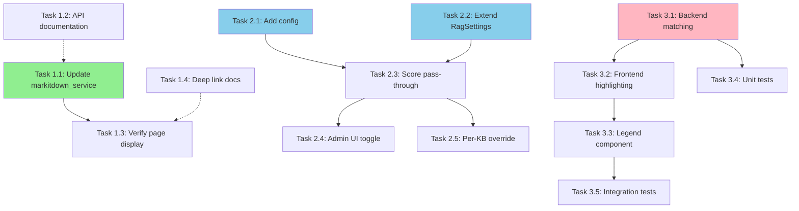

# PRP: RAG UX Enhancements

**Project ID:** 0029a544-b4ce-4c19-b60d-8db912690342
**Branch:** `feature/rag-improvements`
**Generated:** 2025-12-10

---

## Executive Summary

This PRP implements three interconnected RAG user experience enhancements for Open WebUI:

1. **Enhanced External Document Loader** - Standardize page-aware metadata for external document processing services, enabling page number display and future deep-linking support
2. **Reranking Toggle** - Add explicit controls to disable reranking and show raw hybrid (BM25 + vector) scores at both global and per-knowledge-base levels
3. **BM25 Keyword Highlighting** - Visually highlight matched BM25 keywords in citation snippets with color-coded legends

**Total Implementation Tasks:** 18 tasks across 3 phases
**Affected Files:** 10 backend, 3 frontend, 1 external service, 1 documentation

---

## Implementation Tasks

### Phase 1: External Document Loader Enhancement

This phase standardizes the metadata schema for external document loaders and updates the markitdown_service to comply with Open WebUI's 0-based page indexing.

#### Task 1.1: Update markitdown_service Metadata Schema

**Files to modify:**
- `C:\Users\neura\Documents\Repositories\markitdown_service\src\server.py` - Update metadata in `_split_pdf_by_pages()`, `_split_pptx_by_slides()`, and `_split_excel_by_rows()`
- `C:\Users\neura\Documents\Repositories\markitdown_service\src\page_splitter.py` - Update PageSplitter class methods

**Implementation steps:**

1. **Modify PDF page splitting (server.py:192-198)**
   ```python
   # Current (1-indexed)
   doc = {
       "page_content": result.text_content.strip(),
       "metadata": {
           "source": source_name,
           "page": page_num + 1
       }
   }

   # New (0-indexed with additional fields)
   doc = {
       "page_content": result.text_content.strip(),
       "metadata": {
           "source": source_name,
           "page": page_num,  # 0-indexed
           "page_label": str(page_num + 1),  # Human-readable
           "total_pages": len(reader.pages),
           "processing_engine": "markitdown",
           "document_type": "pdf",
           "content_length": len(result.text_content.strip())
       }
   }
   ```

2. **Modify PowerPoint slide splitting (server.py:243-249)**
   ```python
   doc = {
       "page_content": slide_content,
       "metadata": {
           "source": source_name,
           "page": slide_num - 1,  # Convert to 0-indexed
           "page_label": str(slide_num),
           "document_type": "pptx",
           "processing_engine": "markitdown"
       }
   }
   ```

3. **Modify Excel row splitting (server.py:411-417)**
   ```python
   doc = {
       "page_content": chunk_content,
       "metadata": {
           "source": source_name,
           "page": i,  # Already 0-indexed (chunk index)
           "page_label": f"Rows {first_data_row}-{first_data_row + len(chunk_rows) - 1}",
           "document_type": "xlsx",
           "processing_engine": "markitdown"
       }
   }
   ```

4. **Update PageSplitter class (page_splitter.py:92-99)**
   ```python
   doc = {
       "page_content": result.text_content.strip(),
       "metadata": {
           "source": source_name,
           "page": page_num,  # 0-indexed
           "page_label": str(page_num + 1),
           "total_pages": len(reader.pages),
           "processing_engine": "markitdown"
       }
   }
   ```

5. **Update PPTX splitting in PageSplitter (page_splitter.py:145-152)**
   ```python
   doc = {
       "page_content": slide_content,
       "metadata": {
           "source": source_name,
           "page": slide_num - 1,  # Convert to 0-indexed
           "page_label": str(slide_num)
       }
   }
   ```

**Acceptance criteria:**
- [ ] All PDF pages use 0-indexed `page` field
- [ ] All documents include `page_label` for human display
- [ ] PDFs include `total_pages` metadata
- [ ] All documents include `processing_engine` and `document_type`
- [ ] Existing tests pass with updated metadata

---

#### Task 1.2: Create External Loader API Documentation

**Files to create:**
- `backend/open_webui/docs/external-loader-api.md` - Complete API specification

**Implementation steps:**

1. **Create documentation file** with the following sections:
   - API endpoint specification
   - Request/response format
   - Required vs optional metadata fields
   - Page indexing conventions (0-based)
   - Sub-chunking behavior
   - Example implementations
   - Common pitfalls

2. **Document required metadata schema:**
   ```markdown
   ## Required Metadata Fields

   | Field | Type | Required | Description |
   |-------|------|----------|-------------|
   | source | string | Yes | Filename or source identifier |
   | page | integer | Recommended | 0-based page index |
   | page_label | string | Recommended | Human-readable page label |
   | total_pages | integer | Optional | Total document pages |
   | document_type | string | Optional | pdf, pptx, xlsx, docx, etc. |
   | processing_engine | string | Optional | Loader identifier |
   ```

3. **Include examples** for PDF, PowerPoint, and Excel documents

4. **Document sub-chunking behavior:**
   - Metadata preservation through text splitting
   - `start_index` addition by Open WebUI
   - Position reconstruction via `page` + `start_index`

**Acceptance criteria:**
- [ ] Documentation covers all metadata fields
- [ ] Examples provided for common document types
- [ ] Page indexing convention clearly stated (0-based)
- [ ] Sub-chunking behavior explained
- [ ] Referenced from main Open WebUI docs

---

#### Task 1.3: Verify Page Display in Citation UI

**Files to verify:**
- `src/lib/components/chat/Messages/Citations/CitationModal.svelte:155-160` - Page display logic

**Implementation steps:**

1. **Test with markitdown_service documents:**
   - Upload multi-page PDF via external loader
   - Verify page numbers display correctly in citations
   - Check that `(page {document.metadata.page + 1})` shows correct value

2. **Test with existing internal loaders:**
   - Verify Mistral OCR documents still display pages correctly
   - Ensure no regression in page display

3. **Test edge cases:**
   - Documents without page metadata (should not show page)
   - Page 0 displays as "page 1"
   - Custom `page_label` values display correctly

**Acceptance criteria:**
- [ ] Page numbers display for external loader documents
- [ ] 0-indexed pages display correctly (0 → "page 1")
- [ ] No page display when metadata missing
- [ ] No regression in existing loaders

---

#### Task 1.4: Add Deep Link Documentation (Future Enhancement)

**Files to create:**
- `backend/open_webui/docs/deep-linking.md` - Deep linking specification

**Implementation steps:**

1. **Document URL patterns for future implementation:**
   ```markdown
   ## File Viewer URL Pattern
   /api/v1/files/{file_id}/content#page={page_number}

   ## PDF.js External Viewer
   /pdfjs/web/viewer.html?file=/api/v1/files/{file_id}/content#page={page_number}
   ```

2. **Document metadata requirements:**
   - `file_id` preservation in chunk metadata
   - `page` (0-based) presence
   - URL construction location in CitationModal.svelte

3. **Note current limitations:**
   - Open WebUI's built-in viewer doesn't support page anchors yet
   - External viewer integration would require PDF.js setup

**Acceptance criteria:**
- [ ] URL patterns documented
- [ ] Metadata requirements specified
- [ ] Current limitations noted
- [ ] Implementation roadmap outlined

---

### Phase 2: Reranking Toggle Implementation

This phase adds explicit controls to enable/disable reranking at both global and per-knowledge-base levels, with proper score pass-through when disabled.

#### Task 2.1: Add ENABLE_RAG_RERANKING Configuration

**Files to modify:**
- `backend/open_webui/env.py` - Add environment variable
- `backend/open_webui/config.py` - Add PersistentConfig

**Implementation steps:**

1. **Add to env.py (after existing RAG variables):**
   ```python
   # Reranking control
   ENABLE_RAG_RERANKING = os.environ.get("ENABLE_RAG_RERANKING", "True").lower() == "true"
   ```

2. **Add to config.py (in RAG section, after RAG_RERANKING_MODEL):**
   ```python
   ENABLE_RAG_RERANKING = PersistentConfig(
       "rag.enable_reranking",
       "rag.enable_reranking",
       True,  # Default: enabled
       bool,
   )
   ```

3. **Add getter/setter in main.py config section:**
   ```python
   @app.get("/config")
   async def get_config(user=Depends(get_admin_user)):
       return {
           # ... existing config ...
           "ENABLE_RAG_RERANKING": app.state.config.ENABLE_RAG_RERANKING,
       }

   @app.post("/config/update")
   async def update_config(form_data: ConfigUpdateForm, user=Depends(get_admin_user)):
       # ... existing updates ...
       if form_data.ENABLE_RAG_RERANKING is not None:
           app.state.config.ENABLE_RAG_RERANKING = form_data.ENABLE_RAG_RERANKING
   ```

**Acceptance criteria:**
- [ ] Environment variable ENABLE_RAG_RERANKING available
- [ ] PersistentConfig stores value in database
- [ ] Default value is `true` (current behavior)
- [ ] Config API exposes setting

---

#### Task 2.2: Extend RagSettings Model

**Files to modify:**
- `backend/open_webui/models/knowledge.py` - Add enable_reranking field

**Implementation steps:**

1. **Add field to RagSettings class (after full_context):**
   ```python
   class RagSettings(BaseModel):
       top_k: Optional[int] = None
       top_k_reranker: Optional[int] = None
       relevance_threshold: Optional[float] = None
       enable_hybrid_search: Optional[bool] = None
       hybrid_bm25_weight: Optional[float] = None
       full_context: Optional[bool] = None
       enable_reranking: Optional[bool] = None  # NEW
   ```

2. **Update any existing RagSettings constructors/validators** if needed

**Acceptance criteria:**
- [ ] `enable_reranking` field added to RagSettings
- [ ] Field is optional (None = use global setting)
- [ ] Model serialization/deserialization works
- [ ] No breaking changes to existing KB settings

---

#### Task 2.3: Implement Score Pass-Through in RerankCompressor

**Files to modify:**
- `backend/open_webui/retrieval/utils.py` - Modify RerankCompressor class

**Implementation steps:**

1. **Add enable_reranking parameter to RerankCompressor.__init__ (around line 1487):**
   ```python
   def __init__(
       self,
       embedding_function=None,
       top_n: int = 3,
       reranking_function=None,
       r_score: float = 0.0,
       enable_reranking: bool = True,  # NEW parameter
   ):
       self.embedding_function = embedding_function
       self.top_n = top_n
       self.reranking_function = reranking_function
       self.r_score = r_score
       self.enable_reranking = enable_reranking  # Store flag
   ```

2. **Modify acompress_documents method (around line 1549-1572):**
   ```python
   async def acompress_documents(
       self,
       documents: Sequence[Document],
       query: str,
       callbacks: Optional[Callbacks] = None,
   ) -> Sequence[Document]:
       """
       Compress retrieved documents given the query context.
       With enable_reranking=False, returns documents with original ensemble scores.
       """
       if len(documents) == 0:
           return []

       # If reranking disabled, pass through with original scores
       if not self.enable_reranking:
           log.debug("Reranking disabled, passing through ensemble scores")
           return documents[:self.top_n]  # Just limit to top_n

       # Original reranking logic
       reranking = self.reranking_function is not None
       if reranking:
           scores = self.reranking_function(query, documents)
       else:
           # Fallback to cosine similarity if reranking function not available
           query_embedding = await self.embedding_function(
               query, RAG_EMBEDDING_QUERY_PREFIX
           )
           document_embedding = await self.embedding_function(
               [doc.page_content for doc in documents], RAG_EMBEDDING_CONTENT_PREFIX
           )
           scores = util.cos_sim(query_embedding, document_embedding)[0]

       # Rest of existing logic...
   ```

3. **Update query_doc_with_hybrid_search to pass enable_reranking flag (around line 398):**
   ```python
   # Get enable_reranking from settings cascade
   enable_reranking = (
       rag_settings.get("enable_reranking")
       if rag_settings and rag_settings.get("enable_reranking") is not None
       else app.state.config.ENABLE_RAG_RERANKING
   )

   compressor = RerankCompressor(
       embedding_function=embedding_function,
       top_n=k_reranker,
       reranking_function=reranking_function,
       r_score=r_score,
       enable_reranking=enable_reranking,  # Pass flag
   )
   ```

**Acceptance criteria:**
- [ ] RerankCompressor accepts enable_reranking parameter
- [ ] When False, documents returned with original ensemble scores
- [ ] When True, existing reranking behavior preserved
- [ ] Setting cascades from global → per-KB correctly
- [ ] No regression in existing reranking functionality

---

#### Task 2.4: Add Reranking Toggle to Admin UI

**Files to modify:**
- `src/lib/components/admin/Settings/Documents.svelte` - Add toggle in RAG section

**Implementation steps:**

1. **Add checkbox after RAG_RERANKING_MODEL section (around line 300):**
   ```svelte
   <div class="flex items-center justify-between">
       <label for="enable-reranking" class="text-sm font-medium">
           Enable Reranking
       </label>
       <input
           id="enable-reranking"
           type="checkbox"
           bind:checked={RAGConfig.ENABLE_RAG_RERANKING}
           class="toggle"
       />
   </div>

   <div class="text-xs text-gray-500 mt-1">
       When disabled, shows raw hybrid (BM25 + vector) scores without reranking.
       Useful for debugging search quality.
   </div>
   ```

2. **Add to RAGConfig interface if needed:**
   ```typescript
   interface RAGConfig {
       // ... existing fields ...
       ENABLE_RAG_RERANKING: boolean;
   }
   ```

3. **Include in save/load operations:**
   ```typescript
   const loadRAGConfig = async () => {
       const config = await getRAGConfig();
       RAGConfig.ENABLE_RAG_RERANKING = config.ENABLE_RAG_RERANKING ?? true;
       // ... rest of loading ...
   };

   const saveRAGConfig = async () => {
       await updateRAGConfig({
           ENABLE_RAG_RERANKING: RAGConfig.ENABLE_RAG_RERANKING,
           // ... rest of config ...
       });
   };
   ```

**Acceptance criteria:**
- [ ] Toggle appears in Documents settings
- [ ] Default state is checked (enabled)
- [ ] Toggle persists across page reloads
- [ ] Help text explains purpose
- [ ] Styling matches existing toggles

---

#### Task 2.5: Add Per-KB Reranking Override

**Files to modify:**
- Knowledge base settings component (location TBD based on codebase structure)

**Implementation steps:**

1. **Find knowledge base RAG settings UI component**
   - Search for where `RagSettings` fields are edited per-KB
   - Likely in admin knowledge base editor

2. **Add enable_reranking toggle:**
   ```svelte
   <div class="form-group">
       <label>Enable Reranking</label>
       <select bind:value={kb.meta.rag_settings.enable_reranking}>
           <option value={null}>Use Global Setting</option>
           <option value={true}>Enabled</option>
           <option value={false}>Disabled</option>
       </select>
       <small>Override global reranking setting for this knowledge base</small>
   </div>
   ```

3. **Ensure value cascades correctly in backend** (already handled by Task 2.3)

**Acceptance criteria:**
- [ ] Per-KB reranking toggle available
- [ ] "Use Global Setting" option available (null value)
- [ ] Explicit enable/disable options work
- [ ] Cascading logic respects per-KB override
- [ ] UI indicates when overriding global setting

---

### Phase 3: BM25 Keyword Highlighting

This phase implements visual highlighting of matched BM25 keywords in citation snippets with color-coded legends.

#### Task 3.1: Implement Keyword Matching in Backend

**Files to modify:**
- `backend/open_webui/retrieval/utils.py` - Add keyword matching logic
- `backend/open_webui/utils/middleware.py` - Pass matched keywords to frontend

**Implementation steps:**

1. **Create keyword matching function in utils.py (after tokenize_for_bm25):**
   ```python
   def extract_matched_keywords(query: str, document_text: str) -> list[str]:
       """
       Extract which BM25 query tokens matched in the document.

       Args:
           query: User query string
           document_text: Document content

       Returns:
           List of matched keyword tokens (lowercased)
       """
       query_tokens = set(tokenize_for_bm25(query))
       document_tokens = set(tokenize_for_bm25(document_text))

       # Find intersection
       matched = query_tokens & document_tokens

       # Return in original query order for consistent coloring
       return [token for token in tokenize_for_bm25(query) if token in matched]
   ```

2. **Modify query_doc_with_hybrid_search to compute matches (around line 430):**
   ```python
   # After retrieving documents, before returning
   if hybrid_search:
       for doc in retrieved_docs:
           matched_keywords = extract_matched_keywords(query, doc.page_content)
           if matched_keywords:
               doc.metadata["bm25_matched_keywords"] = matched_keywords

   return retrieved_docs
   ```

3. **Update get_sources_from_items in middleware.py to pass keywords:**
   ```python
   # In source metadata construction (around line 1460)
   metadata = {
       **filter_metadata(doc.metadata),
       "name": file.filename,
       "created_by": file.user_id,
       "file_id": file.id,
       "source": file.filename,
   }

   # Preserve bm25_matched_keywords if present
   if "bm25_matched_keywords" in doc.metadata:
       metadata["bm25_matched_keywords"] = doc.metadata["bm25_matched_keywords"]
   ```

**Acceptance criteria:**
- [ ] `extract_matched_keywords()` function correctly identifies matches
- [ ] Matched keywords added to document metadata when hybrid search enabled
- [ ] Keywords passed through to frontend in source structure
- [ ] No keywords added when hybrid search disabled
- [ ] German umlauts preserved in matching

---

#### Task 3.2: Implement Frontend Highlighting Function

**Files to modify:**
- `src/lib/components/chat/Messages/Citations/CitationModal.svelte` - Add highlighting logic

**Implementation steps:**

1. **Add color palette and escapeRegex function:**
   ```svelte
   <script>
       // ... existing imports ...

       const KEYWORD_COLORS = [
           'bg-yellow-200 dark:bg-yellow-800',
           'bg-green-200 dark:bg-green-800',
           'bg-blue-200 dark:bg-blue-800',
           'bg-pink-200 dark:bg-pink-800',
           'bg-purple-200 dark:bg-purple-800',
           'bg-orange-200 dark:bg-orange-800'
       ];

       function escapeRegex(str: string): string {
           return str.replace(/[.*+?^${}()|[\]\\]/g, '\\$&');
       }

       function highlightKeywords(text: string, keywords: string[]): string {
           if (!keywords || keywords.length === 0) return text;

           let result = text;
           keywords.forEach((keyword, idx) => {
               const color = KEYWORD_COLORS[idx % KEYWORD_COLORS.length];
               const escapedKeyword = escapeRegex(keyword);
               const regex = new RegExp(`\\b(${escapedKeyword})\\b`, 'gi');
               result = result.replace(
                   regex,
                   `<mark class="${color} font-semibold rounded px-0.5">$1</mark>`
               );
           });

           return result;
       }
   </script>
   ```

2. **Replace plain text display with conditional highlighting (around line 171):**
   ```svelte
   {#if document.metadata?.bm25_matched_keywords?.length > 0}
       <div class="whitespace-pre-wrap text-sm">
           {@html highlightKeywords(
               document.page_content || document,
               document.metadata.bm25_matched_keywords
           )}
       </div>
   {:else}
       <pre class="whitespace-pre-wrap text-sm">{document.page_content || document}</pre>
   {/if}
   ```

**Acceptance criteria:**
- [ ] Matched keywords highlighted with distinct colors
- [ ] Case-insensitive matching (matches both cases)
- [ ] Word boundary matching (doesn't match partial words)
- [ ] Special regex characters properly escaped
- [ ] Dark mode colors work correctly
- [ ] Falls back to plain text when no keywords

---

#### Task 3.3: Add Keyword Legend Component

**Files to modify:**
- `src/lib/components/chat/Messages/Citations/CitationModal.svelte` - Add legend above content

**Implementation steps:**

1. **Add legend component before content display:**
   ```svelte
   {#if document.metadata?.bm25_matched_keywords?.length > 0}
       <div class="flex flex-wrap gap-2 mb-3 pb-2 border-b border-gray-200 dark:border-gray-700">
           <span class="text-xs text-gray-500 font-medium">Matched terms:</span>
           {#each document.metadata.bm25_matched_keywords as keyword, idx}
               <span class="px-2 py-1 text-xs rounded {KEYWORD_COLORS[idx % KEYWORD_COLORS.length]}">
                   {keyword}
               </span>
           {/each}
       </div>
   {/if}
   ```

2. **Add tooltip explaining highlighting (optional):**
   ```svelte
   <div class="flex items-center gap-2 mb-3">
       <span class="text-xs text-gray-500 font-medium">Matched terms:</span>
       <button
           class="text-gray-400 hover:text-gray-600"
           title="These keywords from your query were found via BM25 keyword search"
       >
           <svg class="w-3 h-3" ...><!-- info icon --></svg>
       </button>
   </div>
   ```

**Acceptance criteria:**
- [ ] Legend displays above content
- [ ] Each keyword shown with matching color
- [ ] Legend hidden when no keywords present
- [ ] Readable in both light and dark modes
- [ ] Keywords displayed in query order (consistent colors)

---

#### Task 3.4: Add Unit Tests for Keyword Matching

**Files to create:**
- `backend/open_webui/test/retrieval/test_keyword_matching.py` - Keyword extraction tests

**Implementation steps:**

1. **Test basic keyword extraction:**
   ```python
   def test_extract_matched_keywords_simple():
       query = "Berlin 2025"
       document = "Berlin is hosting a conference in 2025."

       matched = extract_matched_keywords(query, document)

       assert set(matched) == {"berlin", "2025"}
   ```

2. **Test punctuation handling:**
   ```python
   def test_extract_matched_keywords_punctuation():
       query = "Berlin Germany"
       document = "Berlin, Germany's capital, is a major city."

       matched = extract_matched_keywords(query, document)

       assert "berlin" in matched
       assert "germany" in matched  # Should match despite apostrophe
   ```

3. **Test German umlauts:**
   ```python
   def test_extract_matched_keywords_umlauts():
       query = "München Düsseldorf"
       document = "München und Düsseldorf sind große Städte."

       matched = extract_matched_keywords(query, document)

       assert "münchen" in matched
       assert "düsseldorf" in matched
   ```

4. **Test no matches:**
   ```python
   def test_extract_matched_keywords_no_match():
       query = "Paris France"
       document = "Berlin is the capital of Germany."

       matched = extract_matched_keywords(query, document)

       assert matched == []
   ```

5. **Test partial word non-match:**
   ```python
   def test_extract_matched_keywords_word_boundary():
       query = "test"
       document = "This is a testing document."

       matched = extract_matched_keywords(query, document)

       assert "test" not in matched  # "test" != "testing"
   ```

**Acceptance criteria:**
- [ ] All tests pass
- [ ] Coverage for edge cases (punctuation, umlauts, no matches)
- [ ] Tests verify word boundary matching
- [ ] Tests run in CI/CD pipeline

---

#### Task 3.5: Integration Testing for Highlighting

**Files to modify:**
- Manual testing checklist (no code changes)

**Implementation steps:**

1. **Test with English query:**
   - Query: "machine learning python"
   - Verify "machine", "learning", "python" highlighted
   - Check each has distinct color
   - Verify legend shows all three terms

2. **Test with German query:**
   - Query: "künstliche Intelligenz München"
   - Verify umlauts preserved in highlights
   - Check case-insensitive matching

3. **Test with punctuation:**
   - Document contains: "Berlin, Germany's capital..."
   - Query: "Berlin Germany"
   - Verify both words highlighted despite punctuation

4. **Test with hybrid search disabled:**
   - Disable hybrid search in settings
   - Verify no highlighting appears
   - Confirm plain text display

5. **Test dark mode:**
   - Switch to dark mode
   - Verify highlight colors readable
   - Check legend colors appropriate

6. **Test XSS prevention:**
   - Attempt query with HTML/JS: `<script>alert('xss')</script>`
   - Verify proper escaping, no script execution

**Acceptance criteria:**
- [ ] English keywords highlighted correctly
- [ ] German umlauts work properly
- [ ] Punctuation handled correctly
- [ ] No highlighting when hybrid search off
- [ ] Dark mode colors readable
- [ ] XSS attempts properly escaped
- [ ] Legend matches highlighted terms

---

## File Change Summary

| File | Action | Description |
|------|--------|-------------|
| **External Service** |
| `markitdown_service/src/server.py` | MODIFY | Update PDF, PPTX, Excel metadata to 0-indexed pages |
| `markitdown_service/src/page_splitter.py` | MODIFY | Update PageSplitter class metadata |
| **Backend - Configuration** |
| `backend/open_webui/env.py` | MODIFY | Add ENABLE_RAG_RERANKING environment variable |
| `backend/open_webui/config.py` | MODIFY | Add ENABLE_RAG_RERANKING PersistentConfig |
| `backend/open_webui/models/knowledge.py` | MODIFY | Add enable_reranking to RagSettings |
| **Backend - RAG Logic** |
| `backend/open_webui/retrieval/utils.py` | MODIFY | Add extract_matched_keywords(), update RerankCompressor, add keyword matching |
| `backend/open_webui/utils/middleware.py` | MODIFY | Pass bm25_matched_keywords to frontend |
| **Backend - Documentation** |
| `backend/open_webui/docs/external-loader-api.md` | CREATE | External loader API specification |
| `backend/open_webui/docs/deep-linking.md` | CREATE | Deep linking documentation |
| **Backend - Tests** |
| `backend/open_webui/test/retrieval/test_keyword_matching.py` | CREATE | Unit tests for keyword matching |
| **Frontend - UI** |
| `src/lib/components/chat/Messages/Citations/CitationModal.svelte` | MODIFY | Add highlighting, legend, page display verification |
| `src/lib/components/admin/Settings/Documents.svelte` | MODIFY | Add reranking toggle |
| Knowledge base settings component | MODIFY | Add per-KB reranking override |

**Total Files:** 14 (3 external, 7 backend code, 2 backend docs, 1 backend test, 3 frontend)

---

## Dependencies



**Critical Path:** T1.1 → T1.3 (Phase 1), T2.1 + T2.2 → T2.3 → T2.4 (Phase 2), T3.1 → T3.2 → T3.3 (Phase 3)

**Parallelizable Tasks:**
- Phase 1: T1.2, T1.4 (documentation) can run parallel to T1.1
- Phase 2: T2.1 and T2.2 can run in parallel
- Phase 2: T2.4 and T2.5 can run in parallel after T2.3
- Phase 3: T3.4 can run parallel to T3.2/T3.3

---

## Testing Plan

### Unit Tests

**Test Suite 1: Keyword Matching (`test_keyword_matching.py`)**
- Basic keyword extraction
- Punctuation handling
- German umlaut preservation
- Word boundary matching
- No-match scenarios

**Test Suite 2: Reranking Toggle**
- Score differences between reranked/raw modes
- Per-KB override cascading
- Default behavior preservation
- null value handling

**Test Suite 3: External Loader Metadata**
- 0-indexed page conversion
- Metadata preservation through chunking
- Missing metadata handling

### Integration Tests

**Test Scenario 1: External Loader End-to-End**
1. Upload PDF via markitdown_service
2. Verify document processed with 0-indexed pages
3. Query via RAG
4. Check citation displays correct page numbers

**Test Scenario 2: Reranking On/Off Comparison**
1. Execute same query with reranking enabled
2. Record scores and result order
3. Disable reranking
4. Re-execute query
5. Verify scores differ and show raw hybrid values

**Test Scenario 3: Keyword Highlighting**
1. Enable hybrid search
2. Execute query with specific keywords
3. Verify highlights appear in citations
4. Check legend displays correctly
5. Verify no highlighting when hybrid search off

### Manual Testing

**Checklist:**
- [ ] Multi-page PDF upload shows page numbers in citations
- [ ] Page 1 displays for page index 0
- [ ] Reranking toggle persists across sessions
- [ ] Raw scores visible when reranking disabled
- [ ] Keywords highlighted with distinct colors
- [ ] Legend matches highlighted terms
- [ ] German umlauts highlighted correctly
- [ ] Dark mode highlighting readable
- [ ] XSS attempts properly escaped
- [ ] No regression in existing RAG functionality

---

## Rollback Plan

### Phase 1 Rollback (External Loader)
1. Revert markitdown_service changes:
   - `git checkout HEAD~1 src/server.py src/page_splitter.py`
2. Delete documentation files:
   - `rm backend/open_webui/docs/external-loader-api.md`
   - `rm backend/open_webui/docs/deep-linking.md`

### Phase 2 Rollback (Reranking Toggle)
1. Remove configuration:
   - Revert env.py, config.py changes
   - Remove ENABLE_RAG_RERANKING from database
2. Revert RagSettings model:
   - Remove enable_reranking field from knowledge.py
3. Revert RerankCompressor changes:
   - Restore original acompress_documents logic
4. Remove UI toggles:
   - Revert Documents.svelte changes
   - Revert KB settings changes

### Phase 3 Rollback (Keyword Highlighting)
1. Remove backend matching:
   - Delete extract_matched_keywords() function
   - Remove keyword computation from query_doc_with_hybrid_search
2. Remove frontend highlighting:
   - Revert CitationModal.svelte to plain text display
   - Remove highlightKeywords() function
   - Remove legend component
3. Delete test files:
   - `rm backend/open_webui/test/retrieval/test_keyword_matching.py`

### Full Rollback
```bash
git revert --no-commit <commit-range>
git commit -m "Rollback: RAG UX Enhancements"
git push origin feature/rag-improvements --force-with-lease
```

### Database Cleanup (if needed)
```sql
-- Remove reranking config from database
DELETE FROM config WHERE key = 'rag.enable_reranking';

-- Remove per-KB reranking settings
UPDATE knowledge SET meta = json_remove(meta, '$.rag_settings.enable_reranking');
```

---

## Implementation Notes

### Code Style Guidelines
- Follow existing Open WebUI patterns (PersistentConfig, RagSettings cascade)
- Use type hints for all Python functions
- Add docstrings for new functions
- Follow Svelte component patterns for frontend
- Use TailwindCSS classes for styling

### Performance Considerations
- Keyword matching is O(n) where n = query tokens (typically < 10)
- No noticeable performance impact expected
- Highlighting uses regex replace (fast for typical document sizes)

### Security Considerations
- **XSS Prevention:** Use Svelte's `{@html}` with proper escaping via `escapeRegex()`
- **Regex DoS:** Keyword count limited by query length (< 10 typically)
- **Metadata Injection:** External loader metadata filtered by existing `filter_metadata()` function

### Backward Compatibility
- All changes backward compatible
- External loaders without new metadata fields still work
- Reranking defaults to enabled (current behavior)
- Keyword highlighting only appears when hybrid search enabled

---

## Success Metrics

**Phase 1: External Document Loader**
- [ ] 100% of markitdown_service documents show page numbers
- [ ] 0 regressions in existing page display
- [ ] API documentation complete and reviewed

**Phase 2: Reranking Toggle**
- [ ] Reranking can be disabled at global level
- [ ] Per-KB overrides work correctly
- [ ] Raw hybrid scores visible when disabled
- [ ] 0 breaking changes to existing reranking

**Phase 3: BM25 Keyword Highlighting**
- [ ] Keywords highlighted for all hybrid search queries
- [ ] Legend displays correctly for 100% of highlighted results
- [ ] German umlauts preserved in 100% of test cases
- [ ] 0 XSS vulnerabilities introduced

---

## Related Documentation

- [RAG Executive Summary](RAG_EXECUTIVE_SUMMARY.md) - Overall RAG improvement roadmap
- [BM25 Tokenization Fix](BM25_TOKENIZATION_FIX.md) - Prior BM25 implementation
- [Per-KB Settings Architecture](PRP_rag_per_level_settings.md) - Cascading settings pattern
- [External Document Loader](backend/open_webui/retrieval/loaders/external_document.py) - Current implementation
- [Mistral OCR Loader](backend/open_webui/retrieval/loaders/mistral.py:516-592) - Reference implementation

---

**End of PRP**
